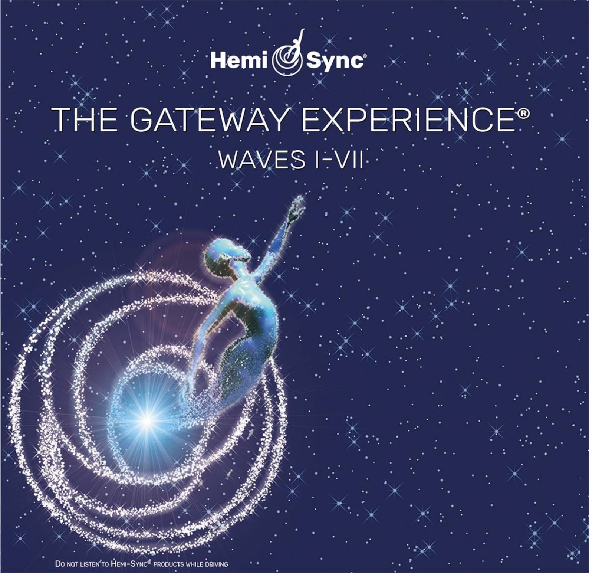

# 📓 Gateway Content Catalog

## Introduction & Content Catalog


It is highly recommended that you start from the BEGINNING, in the Google Drive, all of the original Gateway tapes are numbered, you should start with Tape #1 and then work forward.


***

## [The Original 39 Gateway Process Tapes](https://drive.google.com/drive/folders/1\_3fqyxGRxMfhTqi2NayXGfllcPFBTJ2A?usp=drive\_link)

<figure><figcaption></figcaption></figure>

***

## Additional Resources


Courtesy of my good friend, Cannaman33 ([@HamHam361791](https://x.com/HamHam361791))


### [BioEnergyCode](https://drive.google.com/drive/folders/1vOJS18YdumHHdU5NABJDrUsARRnUT8rJ?usp=drive\_link)

<figure><figcaption>
BioEnergyCode.com
</figcaption></figure>

#### Contents

1. `Chakra 5 Minute BioEnergy Healing`
   1. 1st Chakra
   2. 2nd Chakra
   3. 3rd Chakra
   4. 4th Chakra
   5. 5th Chakra
   6. 6th Chakra
   7. 7th Chakra
2. `PDF Manuals`
   1. `BioEnergy Code Decoder`
   2. `The Heart Energy Activator Manual`
   3. `The BioEnergy Code Manual`
3. Additional Resources
   1. `BioEnergyCode Bliss.mp3`
   2. `The BioEnergyCode.mp3`
   3. `The Heart Energy Activator.mp3`

***

### [Gateway Manuals](https://drive.google.com/drive/folders/1z46DTyKcjmjLsn0AwJDnAe2dMWff--l7?usp=drive\_link)

#### Contents

1. `Consciousness as per Gateway Process.pdf`
2. `Gateway Analysis.pdf`
3. `Gateway Workbook.pdf`
4. `Discovery Manual.pdf`
5. `Freedom Manual.pdf`
6. `Adventure Manual.pdf`
7. `Exploring Manual.pdf`
8. `Odyssey Manual.pdf`
9. `Voyager Manual.pdf`
10. `Wave I - Discovery.pdf`
11. `Journey of Robert Monroe.pdf`

### [Solfeggio Frequencies](https://drive.google.com/drive/folders/1P-LpWtS8TZ1SwnGMKxyE79f8UqBA4tdI?usp=drive\_link)

#### Contents

1. `174 Hz.mp3`
2. `285 Hz.mp3`
3. `396 Hz.mp3`
4. `417 Hz.mp3`
5. `528 Hz.mp3`
6. `639 Hz.mp3`
7. `741 Hz.mp3`
8. `852 Hz.mp3`
9. `963 Hz.mp3`

***

### [SyncCreation](https://app.gitbook.com/s/uT4h7e9r9o0sZ7MNj2Fj/)

<figure><figcaption></figcaption></figure>

#### Contents

1. `CD 1`
   1. `Intro To Focus 10`
   2. `Advanced Focus 10`
2. `CD 2`
   1. `Free Flow Focus 10`
   2. `Intro to Access Channel`
3. `CD 3`
   1. `Intro to Focus 12`
   2. `Free Flow Focus 12`
4. `CD 4`
   1. `Abundance Tree`
   2. `Creation 12`
5. `CD 5`
   1. `Create`
   2. `Dis-Create`
6. `CD 6`
   1. `Release & Recharge`
   2. `Spoon Bending Exercise`

***

### [A Unicorn Named Georgia - Bedtime Story](https://drive.google.com/file/d/18Xz5EXJ8\_7zoAuIyawk0P93SPyAGPln7/view?usp=drive\_link)

<figure><figcaption></figcaption></figure>

A magical bedtime story about a very special unicorn with Hemi-Sync sleep enhancement frequencies.

Long ago and far away, in the land where magic and fairy tales begin, lived a very special unicorn named Georgia. As the only unicorn to be born with a golden horn, Georgia yearned to be like her friends, who often made fun of her, until one day her shiny golden horn saved the day. Track 1 features Georgia’s magical bedtime story voiced by the author, Morgan MacKenzie-Perkins, along with Hemi-Sync sleep enhancement frequencies to gently guide your child into a deep and restful sleep

***

## Out-Of-Body Techniques \[COMING SOON]

<figure><figcaption></figcaption></figure>


Coming Soon! Stay Tuned!

