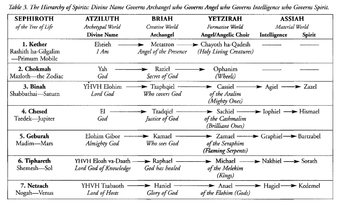

# 🌳 Tree of Life & Kabbalistic

## Layout, Spheres, & Paths

<figure><figcaption></figcaption></figure>

<figure><figcaption></figcaption></figure>

## Magical Images of Sephirot

<figure><figcaption></figcaption></figure>

<figure><figcaption></figcaption></figure>

## Golden Dawn Paths

<figure><figcaption></figcaption></figure>

<figure><figcaption></figcaption></figure>

## Lightning Flash & Serpant

<figure><figcaption></figcaption></figure>

<figure><figcaption></figcaption></figure>

## The Four Worlds of Kabbalah

<figure><figcaption></figcaption></figure>

<figure><figcaption></figcaption></figure>

## Atziluth - The Archetypal World

<figure><figcaption></figcaption></figure>

<figure><figcaption></figcaption></figure>

## Seven Earths & Seven Hells

<figure><figcaption></figcaption></figure>

## Sepher Yetzirah

### Elementals

<figure><figcaption></figcaption></figure>

<figure><figcaption></figcaption></figure>

## Intelligences

<figure><figcaption></figcaption></figure>

<figure><figcaption></figcaption></figure>

## Hierarchy of Spirits

Divine Name Governs Archangel who Governs Angel who Governs Intelligence who Governs Spirit.

### Chicken Kabbalah Reference Tables



#### Referenced from "Chicken Kabbalah"



<figure><figcaption>
Table 3: The Hierarchy of Spirits
</figcaption></figure>

<figure><figcaption>
Table 3 Cont: The Hierarchy of Spirits
</figcaption></figure>
