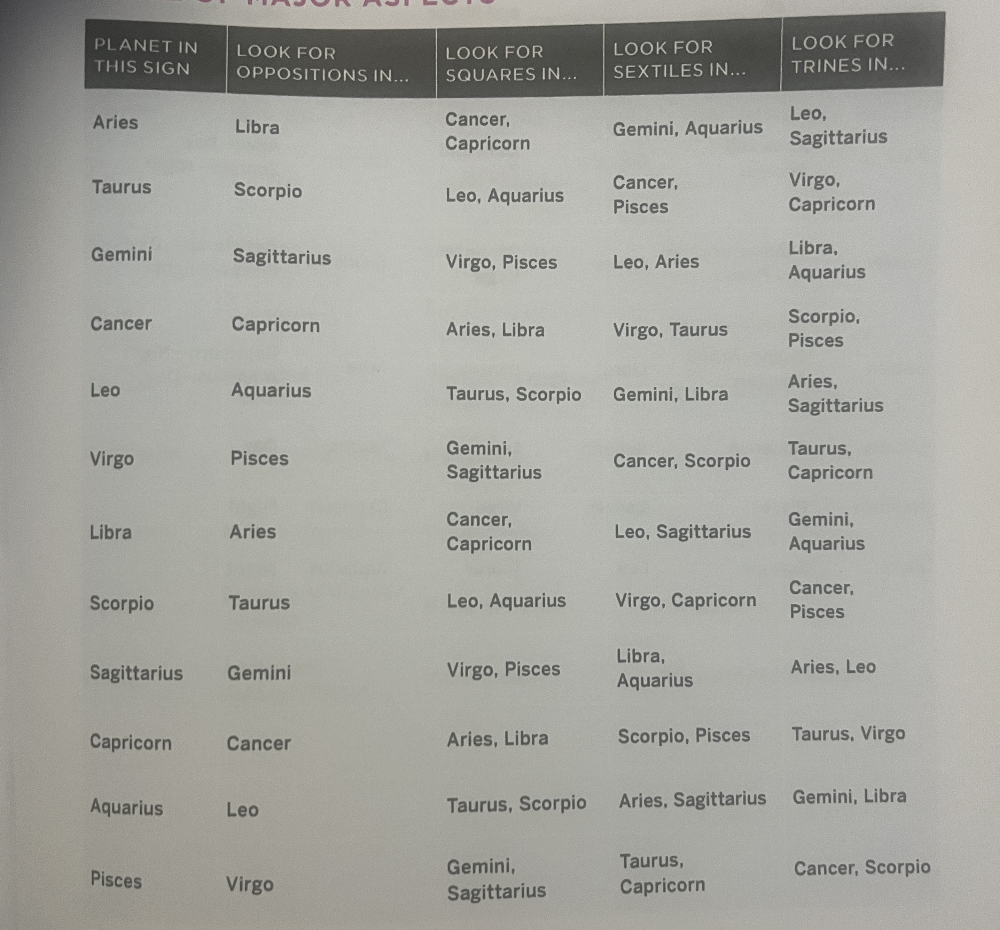

# 🌏 Astrology Reference

## Modalities & Elemental Attributions

| Sign           | Modality                                   | Elemental                                  |
| -------------- | ------------------------------------------ | ------------------------------------------ |
| ♈︎ Aries       | <mark style="color:red;">Cardinal</mark>   | 🜂 <mark style="color:orange;">Fire</mark> |
| ♉︎ Taurus      | <mark style="color:green;">Fixed</mark>    | 🜃 <mark style="color:green;">Earth</mark> |
| ♊︎ Gemini      | <mark style="color:purple;">Mutable</mark> | 🜁 <mark style="color:yellow;">Air</mark>  |
| ♋︎ Cancer      | <mark style="color:red;">Cardinal</mark>   | 🜄 <mark style="color:blue;">Water</mark>  |
| ♌︎ Leo         | <mark style="color:green;">Fixed</mark>    | 🜂 <mark style="color:red;">Fire</mark>    |
| ♍︎ Virgo       | <mark style="color:purple;">Mutable</mark> | 🜃 <mark style="color:green;">Earth</mark> |
| ♎︎ Libra       | <mark style="color:red;">Cardinal</mark>   | 🜁 <mark style="color:yellow;">Air</mark>  |
| ♏︎ Scorpio     | <mark style="color:green;">Fixed</mark>    | 🜄 <mark style="color:blue;">Water</mark>  |
| ♐︎ Sagittarius | <mark style="color:purple;">Mutable</mark> | 🜂 <mark style="color:red;">Fire</mark>    |
| ♑︎ Capricorn   | <mark style="color:red;">Cardinal</mark>   | 🜃 <mark style="color:green;">Earth</mark> |
| ♒︎ Aquarius    | <mark style="color:green;">Fixed</mark>    | 🜁 <mark style="color:yellow;">Air</mark>  |
| ♓︎ Pisces      | <mark style="color:purple;">Mutable</mark> | 🜄 <mark style="color:blue;">Water</mark>  |

### <mark style="color:red;">Cardinal</mark> Modality

Cardinal Modality like to begin new projects but lack the staying power to bring ideas to fruition

### <mark style="color:green;">Fixed</mark> Modality

Fix in place that which was started by the Cardinal Modality Signs

### <mark style="color:purple;">Mutable</mark> Modality

Very flexible, changeable and versatile. "Shiny object syndrome"

***

## Decans

A decan is a subdivision of 10 degrees of an Astrological sign. 36 Sections.

* **First Decan:** _0-9 deg_
* **Second Decan: 10-19** _deg_
* **Third Decan: 20-29** _deg_

### Traditional Decans

<figure><figcaption></figcaption></figure>

### Golden Dawn Decans

<figure><figcaption></figcaption></figure>

## Houses of the Zodiac

<figure><figcaption></figcaption></figure>

## Planetary Dignities & Debilities

* **Rulership:** This is where the planet is most at home
* **Detriment:** Where the planet is in the opposite sign to its rulership, it is said to be weakened.
* **Exaltation:** This is the sign that provides the best expression of the planet AFTER its domicile
* **Fall:** When the planet is in the opposite sign to it's exaltation, it's said to be at its WEAKEST

| Planet    | Rulership            | Detriment            | Exaltation        | Fall                    | Day / Night                                |
| --------- | -------------------- | -------------------- | ----------------- | ----------------------- | ------------------------------------------ |
| ☿ Mercury | Gemini & Virgo       | Sagittarius & Pisces | Virgo             | Pisces                  | Gemini - Day Virgo - Night                 |
| ☽ Moon    | Cancer               | Capricorn            | Taurus            | Scorpio                 | Night                                      |
| ♀ Venus   | Taurus & Libra       | Scorpio & Aries      | Pisces            | Virgo                   | 
Taurus -Night Libra - Day
        |
| ♃ Jupiter | Sagittarius & Pisces | Gemini & Virgo       | Cancer            | Capricorn               | 
Sagittarius - Day Pisces - Night
 |
| ♂ Mars    | Aries & Scorpio      | Libra & Taurus       | Capricorn         | Cancer                  | 
Aries - Day Scorpio - Night
      |
| ☉ Sun     | Leo                  | Aquarius             | Aries             | Libra                   | Day                                        |
| ♄ Saturn  | Capricorn & Aquarius | Cancer & Leo         | Libra             | Aries                   | 
Capricorn - Night Aquarius - Day
 |
| ♅ Uranus  | Aquarius             | Leo                  | Scorpio           | Taurus                  | Day                                        |
| ♆ Neptune | Pisces               | Virgo                | Leo (or Cancer)   | Aquarius (or Capricorn) | Night                                      |
| ♇ Pluto   | Scorpio              | Taurus               | Aries (or Pisces) | Libra (or Virgo)        | Night                                      |

## Aspects

| Aspect                     | Mood                     | Description                                                        |
| -------------------------- | ------------------------ | ------------------------------------------------------------------ |
| 0° - Conjunction ☌         | Blending                 | Intensifies & Confuses - Planets Lose Individuality                |
| 180° - Opposition ☍        | Disharmonius             | Planets oppose each other similar to polarity of a magnet          |
| 120° - Trine ⧋             | Harmonious               | Planets work effortlessly together                                 |
| 90° - Square ◻             | Challenging / Energizing | Greatest tension between the planets                               |
| 60° - Sextile              | Harmonious               | Requires conscious effort to assimilate and embody potential power |
| 150° - Quincunx Inconjunct | Challenging              | Planets cannot be integrated together, very challenging            |
| 72° - Quintile Q           | Creative Talent          | Creative Talents regarding patterns and structures                 |
| 45° - Semisquare ∠         | Block                    | Similar to a square, inflexibility                                 |
| 135° - Sesquisquare ⦞      | Not Divisible by 360     | Tension and challenge, needing control                             |
| 30° - Semisextile ⦡        | Mixed                    | Helpful for one's soul's evolutionary growth                       |

### Aspects Reference Table

<figure><figcaption></figcaption></figure>

## Planetary Symbolism Reference

### ☉ Sun

The Sun symbolizes a personal identity. It shows us areas where the person should learn to be independent, where he should fulfill his potential, differentiate himself from others and shine. The position of the Sun may tell us which profession would best suit the character of a person.

### ☽ Moon

Place in the horoscope where the Moon is tells us what gives the person a sense of security, and where to find it. It describes how sensitive we are and how we instinctively interact with our surroundings. The Moon also tells us about our childhood and our experiences with our mother.

### ☿ Mercury

Mercury is the planet that brings us interest in intellectual things, about teaching and learning. It also indicates into what depth we want to study things. It gives us natural intelligence and the ability to analyse and reproduce.

### ♀ Venus

Venus symbolizes attractivity. Sign in which Venus is tells us what we are attracted to and this enables us to give or receive love and affection, beauty and happiness, values and principles. The negative side is that it represents weakness and shallowness.

### ♂ Mars&#x20;

Mars symbolizes the need to get what we want. This means our driving force which includes sex drive, initiative and courage. Mars tells us about our desires, sensuality, courage and will. It also tells us about how we are able to overcome obstacles and how active we are.

### ♃ Jupiter

Jupiter symbolizes growth, expansion, laws, faith and ethics that guide it. It represents a sense for development and support, which can lead to opportunities, wealth and faith. However, if Jupiter is damaged, the person becomes immoral and extremist.

### ♄ Saturn

Saturn is our strict teacher who is able to ruthlessly examine our maturity. However, it is not only the despot, but also the archetype of the sage who uses pain as a means to get our attention on what we should focus on and what we should continue to develop.

### ♅ Uranus

Uranus is the power of awakening, which often means that there will be some disruption and change. Events under the influence of Uranus are unexpected or unpredictable, forcing us to do things in a new way and face the truth about this or that issue.

### ♆ Neptune

Neptune is called the Lord of the Invisible Empire, which is a mysterious name of a mysterious planet. Perhaps we could describe it as a dimension of life that cannot be experienced by our five senses and we can only understand and perceive it in our imagination.

### ♇ Pluto

Pluto is the planet of death and rebirth. It is the end of all things, it is the Judgment Day. It can give rise to obsessions or convictions. On the dark end of its spectrum it can manifest as "succumbing to the urge," or it can create an individual who has the ability to get to the core of things, destroy negative things and bring on healing and transformation.

## Lunar Node Symbolism

### North & South Nodes

The Lunar Nodes aren’t planets, but rather astrology mathematical points, that are directly opposite each other in the chart. It is said, that your life purpose is encoded between them - in the line between North Node and South Node. The South Node indicates your comfort zone, your habitual place, while your North Node shows life lessons and what you’re striving for in this lifetime. Both Lunar Nodes are almost always retrogade.

### Lilith

Lilith is a fictional point - the second empty focal point of elliptical orbit of the Moon around the Earth. In mythology, Lilith refused to submit to Adam, rebelled against the connection between Adam and Eve, decided to escape from the world of people and made a connection with Satan. In astrology, Lilith symbolizes either fascination or refusal of topics with which she is connected with. Both, the fascination or the rejection of the given topics, can eventually engulf the person and take him "away" from the human world.

### Chiron

Chiron is an asteroid between Saturn and Uranus. Its orbit is very unusual and represents a bridge between material and spiritual worlds. According to mythology, Chiron was a great healer, wise teacher and one of the immortal Centaurs. Unfortunately, he was "deadly" injured by a poisonous arrow by Heracles, his favourite disciple. He was suffering in great pain but he could not die. Finally, he gave up his immortality for the benefit of Prometheus who was also suffering, and Chiron was sent to the underworld. In the underworld Zeus had mercy for him and he raised him to the heaven. In astrology, Chiron symbolizes our unhealable injuries and incurable trauma. However, if a person, instead of drowning in his own trauma, is able to accept the trauma and help others who are also suffering, and accept that suffering is part of life, then Chiron may be the key to wisdom, or even to some sort of "Initiation Gate".
