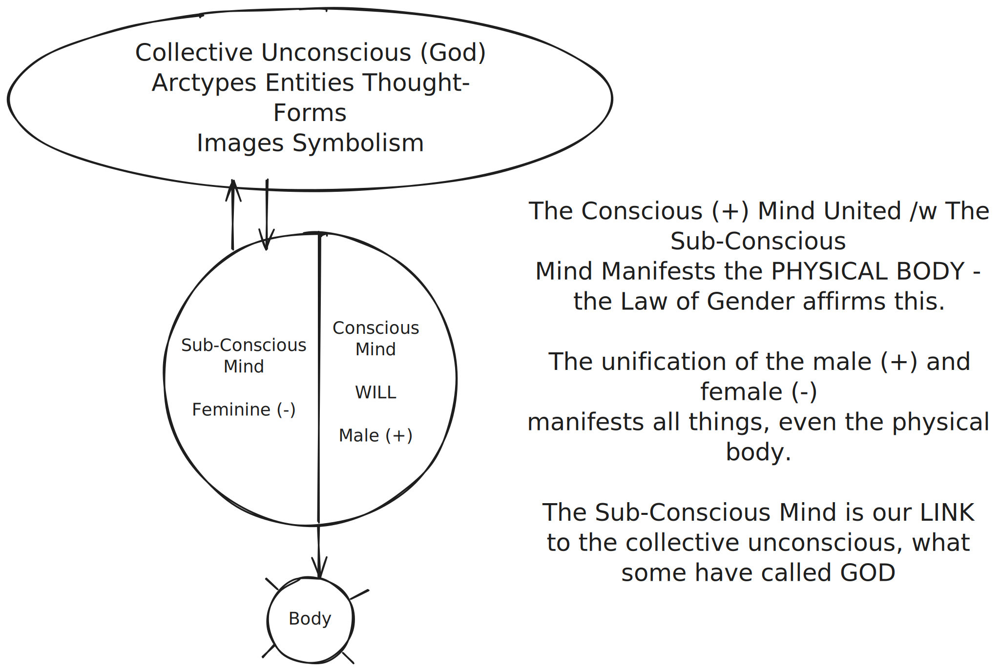
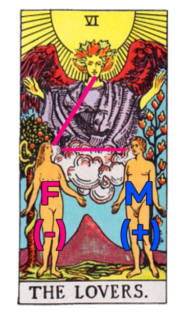

# 🧠 The Great Manifestation

## Introduction

The <mark style="color:blue;">Conscious (M, +) Mind</mark> United /w The <mark style="color:red;">Sub-Conscious Mind (F, -)</mark> Manifests the <mark style="color:yellow;">PHYSICAL BODY</mark>

### Hermetic Law of Gender

> Gender is in everything; everything has its Masculine and Feminine Principles; Gender manifests on all planes.\
> \
> \- The Kybalion

The Hermetic Law of Gender affirms this.

The unification of the male (+) and female (-) manifests all things, even the physical body.

The Sub-Conscious Mind is our LINK to the collective unconscious, what some have called GOD

<figure><figcaption>
Diagram of the Conscious + Sub-Conscious Mind
</figcaption></figure>

### VI - The Lovers

<figure><figcaption></figcaption></figure>

We clearly see this dynamic illustrated in the Sixth card of the Major Arcana (VI - The Lovers)

### Bob Proctor Explains Paradigms


Bob Proctor Explains Paradigms


### The Subconscious Mind - [Mind & Magick](https://www.youtube.com/@mindandmagick)

#### Check out his full playlist [The Mystery School](https://youtube.com/playlist?list=PLWL-f1YBw48NKF1PasvuAM5oyiT73A12i\&si=0PuZbJDGZLPMuUzB)




